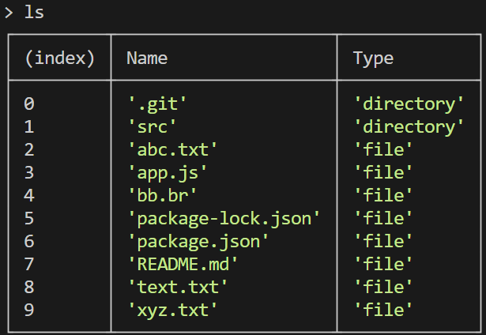

## File Manager Task 
--------------------

- Use 20 LTS version of Node.js
- The program is started by npm-script `start` in following way:
```bash
npm run start -- --username=your_username
```
```bash
node app -- --username=user
```
- or just
```bash
npm run start
``` 
- After program work finished `ctrl + c` pressed or user sent `.exit` command into console 
- (nwd)
    ```bash
    up
    ```
    ```bash
    cd path_to_directory
    ```
    ```bash
    ls
    ```
      
- (basic) 
    ```bash
    add new_file_name
    ```
    ```bash
    rn path_to_file new_filename
    ``` 
    ```bash
    rm path_to_file
    ```
- (streams) 
    ```bash
    cat path_to_file
    ```
    ```bash
    cp path_to_file path_to_new_directory
    ```
    ```bash
    mv path_to_file path_to_new_directory
    ``` 
    
- (os)  
    ```bash
    os --EOL
    ```
    ```bash
    os --cpus
    ```  
    ```bash
    os --homedir
    ```
    ```bash
    os --username
    ```  
    ```bash
    os --architecture
    ```
- (hash)  
    ```bash
    hash path_to_file
    ``` 
- (br)  
    ```bash
    compress path_to_file path_to_destination
    ``` 
    ```bash
    decompress path_to_file path_to_destination
    ```
    